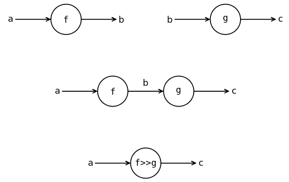
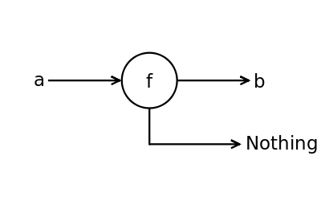
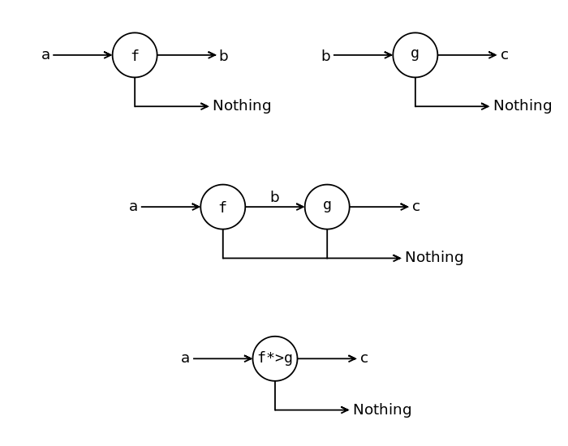
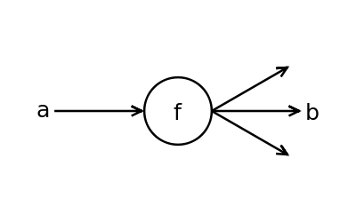
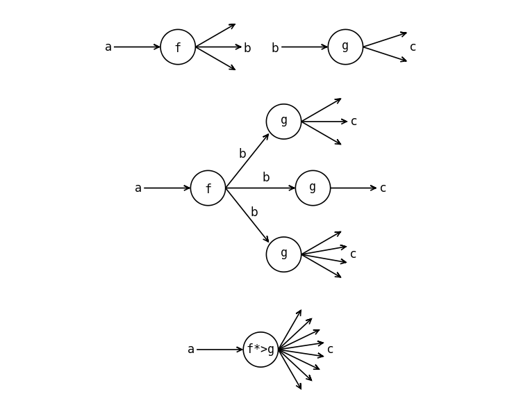
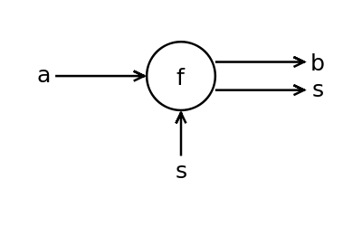
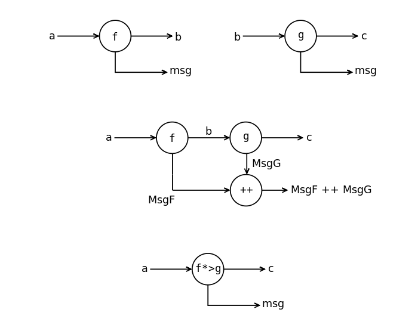

Monads for Drummers
===============================

I'd like to explain the Haskell's Monad class. 
There are so many monad tutorials. Do we need yet another one?
But no one tried to explain it so that even a drummer can understand it!

It's just a joke, there is another reason.

The need for writing this tutorial comes from the desire to translate
a chapter from my book on Haskell that is written in Russian. 
Many people claimed that they could finally get into Monads after reading
my explanation. So I'd like to make it available for English speaking community.

The need for monad
-------------------------------

Do we really need monads after all? The Python, Java or Scala folks
can do cool stuff without it. Can we do the things we want with Haskell
as we accustomed to with imperative languages and leave the Monads aside as some brainy concept.
Brainy concept for the beauty of functional programming. Well, ok, ok. But
we are real coders. We can code without Monads!

It happens that the answer is NO. We can not do anything real 
in Haskell without grasping the Monad concept. Since the Monads 
are responsible for input/output in the Haskell. 

But wait a minute so many languages can live without Monads,
why do we need them in Haskell? Well, the short answer is
because Haskell is different. It's not like anything else.

Let me show the long answer.

### Order of execution (equational reasoning)

Let's start with a small program. Let's prompt the user for 
a string and then another one. We are going to return 
a string that contains both strings. Let me write it in Python:

~~~python
def getBoth():
  x = input()
  y = input()
  return (x + y)
~~~

Don't worry if you don't know the Python. It's not that hard to understand.
With `def` we define a function called `getBoth`.
The `input` gets the user input and with return we concatenate the user inputs.
In python the `+` concatenates strings.
So we read user input twice and concatenate the results. 

Let's write another program. It reads the input only once 
and returns it twice. It looks like this in Python:

~~~python
def getOne():
  x = input()  
  return (x + x)
~~~

Pretty clean code. Can we translate it to Haskell? Let's try:

~~~haskell
getBoth () = res
    where
        x = input ()
        y = input ()
        res = x ++ y
~~~

Let's try to translate the second example. We want the user to type only once:

~~~haskell
getBoth () = res
    where
        x = input ()        
        res = x ++ x
~~~

Unfortunately (or maybe for a good reason) it's not going to work. 
we are about to see what makes Haskell so different from Python or 
from many other languages. In Python we have explicit order of execution.
Do this line then do the next one if you are done make the third one and so on.
So when the Python executes `getBoth` it executes it line by line:

~~~python
x = input()     // 1:
y = input()     // 2:
return (x + y)  // 3: return the result
~~~

But the Haskell executes statements by functional dependencies!
Let's execute the `getBoth`. It says: I need to return `res`, so
let's look at the `res` definition. We can see the expression `(x ++ y)`.
So let's look at the definition of `x` and `y`. Well `x` is `input()`
so I can substitute `x` for `input()`. Well the `y` is also `input()`
so I can substitute it too. The expression becomes: 

~~~
input () ++ input ()
~~~

Well we need to query user twice for input, concatenate strings
and we are done! The funny things start to show off when we try
to apply the same procedure to the function `getOne`. Let's try!

So the we need to calculate the `res`. The `res` is `x ++ x`. 
We need to calculate the `x`. The `x` is `input ()`. So we need
to substitute the `x`. And surprisingly we get the same answer
as for the `getBoth` function:

~~~
input () ++ input ()
~~~

The problem is that from the Haskell's point of view there is no
difference between `getBoth` and `getOne` functions.
The Haskell has no "line by line" order of execution. 
This strategy of execution dominates most of the languages
and the order of execution is easy to grasp. 
But in Haskell the order of execution is derived from
functional dependencies. We need to execute only subexpressions
that result contains. Then we need to execute subexpressions 
for those subexpressions. 

Recall that you can write functions in any order. The `main`
function can come first and then we can define all subexpressions. 
Haskell compiler seems to understand the right order of execution.

Equational reasoning is an assumption that we can always substitute
expressions with their definitions. But we can clearly see how this
strategy prevents us from writing useful programs. 
If we can not write so simple programs as `getOne` and `getBoth`.
How can we use the language like this?

Wait a moment! Monads are going to save the Haskell out of trouble!
Or introduce many more troubles for the novices.. trying to grasp all this stuff.

### Here is the Key idea

## Monads can introduce the order of execution!

With monads we can simulate this line by line behavior. 
But let's dive deeper into the notion of the order.
Let's stretch our brains a little bit. 
Let's recall the concept of `Monoid`. 

~~~haskell
class Monoid a where
    mempty   :: a
    (<>)     :: a -> a -> a
~~~

We have two methods. There are rules:

~~~haskell
mempty <> a      === a
a      <> mempty === a

a <> (b <> c)    === (a <> b) <> c
~~~

So there is a neutral element `mempty` and one binary operation `<>`.
The first an second rules say that `mempty` does nothing. 
But `<>` stacks one thing after another and there is no difference
in what subexpression of `<>` to execute as long as we preserve the order. 
they are aligned in sequence. The `<>`  is called `mappend` in the standard library
and `<>` is an alias. I use it as a main method here to simplify things.

Let's look at one example. The list of things is a monoid:

~~~haskell
instance Monoid [a] where
    mempty = []
    a <> b = a ++ b
~~~

So the `mempty` is an empty list and with sequencing we concatenate the lists. 
Pretty natural! Let's look also at functions `a -> a`. There is a monoid instance for them too!

~~~haskell
id x = x
(g . f) x = g (f x)

instance Monoid (a -> a) where
    mempty = id
    f <> g = g . f
~~~

The `mempty` is an identity function. It does nothing with the input.
The `<>` is composition of the functions. It applies the first function and then the second one.
With this instance we get very close to the notion of sequencing things!

Let's return to the Python. Let's imagine that with some monoid instance 
we can sequence the order of execution:

~~~haskell
    (x = input ())
<>  (y = input ())
<>  (return (x + y))
~~~

The `input` returns some value and stores it to variable `x`.
We need to use this value somehow. But how can we do it?
What if our statements are functions and we can pass the user 
string as input for the next function:

~~~haskell
    (x = input ())
<>  (y = input ())
~~~

becomes 

~~~haskell
    input ()
<>  (\x -> y = input ())
~~~

And we can also rewrite the `y = input()`:

~~~haskell
    input ()
<>  (\x -> 
            input ()
        <>  \y -> return (x ++ y)
    )
~~~

In fact that is exactly what Monad class is doing for user input/output.
Let's look at the class Monad:

~~~haskell
class Monad m where
    return :: a -> m a
    (>>=)  :: m a -> (a -> m b)
~~~

Don't try to understand it! I think a lot of confusion
comes with this definition. It's not clear how it relates to ordering.
But we can study a structure that is equivalent to the Monad. 
It's called a Kleisli category. 

~~~haskell
class Kleisli m where
    idK  :: a -> m a
    (*>) :: (a -> m b) -> (b -> m c) -> (a -> m c)
~~~

It defines two methods: the identity function `idK` and the composition function.
If the meaning is not clear to you try to clear the `m`s. It becomes:

~~~haskell
idK  :: a -> a
(*>) :: (a -> b) -> (b -> c) -> (a -> c)
~~~

We can represent this with picture:

There are rules for `Kleisli`. Surprisingly they look a lot like `Monoid` rules:

~~~haskell
idK *> a      === a
a   *> idK    === a

(a *> b) *> b === a *> (b *> b)
~~~

The `Kleisli` is equivalent to `Monad`. I'll show it later. 
You can clearly see the monoid structure in the Kleisly. 
It has a function that does nothing and it has composition of things
that preserves the order. We are going to consider our first example later.
But now we proceed with more simple examples of monads.

The `Kleisli` is not defined in standard library. It's just my way
to explain monads. You can define it yourself in the file:

~~~haskell
module Main where

import Prelude hiding ((*>))

class Kleisli m where
    idK  :: a -> m a
    (*>) :: (a -> m b) -> (b -> m c) -> (a -> m c)
~~~

Examples
-------------------------------

### The partially defined functions (Maybe)

There are functions that are defined not for all inputs. 
They can return the value or fail.

There is a function `head` that returns a first element in the list:

~~~haskell
head (x:xs) = x
head []     = error "crash"
~~~

We can see that it's undefined for the empty list.
There is a special type `Maybe a` that can handle partially
defined functions. 

~~~haskell
data Maybe a = Nothing | Just a
~~~

We can define a safe version of the `head`:

~~~haskell
headSafe :: [a] -> Maybe a
headSafe xs = case xs of
    (x:_) -> Just x
    []    -> Nothing
~~~

Also we can define a function that extracts a tail from the list safely:

~~~haskell
tailSafe :: [a] -> Maybe [a]
tailSafe xs = case xs of
    (_:as) -> Just as
    []     -> Nothing
~~~

What if we want to define the function that safely extracts
the second element from the list? It would be nice to define it like this:

~~~haskell
secondSafe = headSafe . tailSafe
~~~

So the second element is just the `headSafe` that is applied twice.
Alas we can not do it. The input and output types don't match.

But if there is an instance of Monad or Kleisli for Maybe, we can define it like this:

~~~haskell
secondSafe = tailSafe *> headSafe
~~~

The third element is not that difficult to define:

~~~haskell
thirdSafe = tailSafe *> tailSafe *> headSafe
~~~

To appreciate the usefulness of this approach I'm going to define 
the `secondSafe` in the long way:

~~~haskell
secondSafe :: [a] -> Maybe a
secondSafe xs = case xs of
    (_:x:_) -> Just x
    _       -> Nothing
~~~

Let's look at the definition of composition for functions with `Maybe`:

If the first function produces the value we are going to apply the second function. 
If the first function or second one fails we are going to return `Nothing`.
It's very natural definition for partially applied functions.
We can encode it:

~~~haskell
instance Kleisli Maybe where
    idK a = Just a
    f *> g = \x -> case f x of
        Just a  -> g a
        Nothing -> Nothing
~~~

Functions that can return many values
---------------------------------------

Some functions can return multiple values. They can return list of results.

As an example consider the L-systems. They model the growth of a being.
The being is organized with a row of cells. Each cell can divide or split
in many cells. We can encode cells with letters and the splitting of cells with rules.

~~~haskell
a -> ab
b -> a
~~~

Let's start with `a` and see how it grows:

~~~haskell
a
ab
aba
abaab
abaababa
~~~

We can model the rules with Haskell:

~~~haskell
next :: Char -> String
next 'a' = "ab"
next 'b' = "a"
~~~

Then with Kleisli instance it's very easy to define the growth function.
Let's see how the composition is implemented:

We apply the second function to all outputs of the first function
and we concatenate all results into the single list.

~~~haskell
instance Kleisli [] where
    idK     = \a -> [a]
    f *> g  = \x -> concat (map g (f x))
~~~

Let's define the growth function:

~~~haskell
generate :: Int -> (a -> [a]) -> (a -> [a])
generate 0 f = idK
generate n f = f *> generate (n - 1) f
~~~

We can try it with `next`:

~~~haskell
> let gen n = generate n next 'a'
> gen 0
"a"
> gen 1
"ab"
> gen 2
"aba"
> gen 3
"abaab"
> gen 4
"abaababa"
~~~

Functions with state
------------------------------

Another useful function is a function with a state.
It calculates its result based on some state value.

It expects the initial state and it returns 
the pair of value and updated state. In Haskell it's defined
in the module `Control.Monad.State`.

~~~haskell
data State s a = State {  runState :: s -> (a, s) }
~~~

Can you guess the Kleisli definition by looking at
the picture of composition?

The Monad class
-----------------------------------

So we can see that Kleisli is all about sequencing things.
Let's take a closer look at `Monad`:

~~~haskell
class Monad m where
    return :: a -> m a
    (>>=)  :: m a -> (a -> m b) -> m b
~~~

We can see that `return` is function `idK` for the `Kleisli` class.
What is the `>>=`. It's called bind. We can see better what it can
do if we clear the `m` out of the signature:

~~~haskell
a -> (a -> b) -> b
~~~

What if we reverse the arguments:

~~~haskell
(a -> b) -> a -> b
~~~

It's an application of the function to the value!
So the monadic bind method is just an application
of the monadic value (wrapped in some structure `m`)
to the function that returns another monadic value.
We can express the `Monad` class with `Kleisli`:

~~~haskell
instance Kleisli m => Monad m where
    return  = idK
    a >>= f = ((\_ -> a) *> f) ()
~~~

We first create a function out of the value and we apply the function 
to an empty tuple to express application with composition. 

Also we can define `Kleisli` in terms of `Monad`:

~~~haskell
instance Monad m => Kleisli m where
    idK    = return
    f *> g = \x -> x f >>= g
~~~

Let's turn back to the example with user input. How can we rewrite 
the three simple lines with Haskell:

~~~Python
x = input ()
y = input ()
return (x ++ y)
~~~

Can you recall that we transformed it with monoid methods:

~~~haskell
    (x = input ())
<>  (y = input ())
<>  (return (x + y))
~~~

and then later to 

~~~haskell
    input ()
<>  (\x -> 
            input ()
        <>  \y -> return (x ++ y)
    )
~~~

It turns out that the monoid sequencing `<>` is 
like bind or sequencing for `Kleisli`. So with
real Haskell we get:

~~~haskell
    input ()
>>= (\x -> 
            input ()
        >>= \y -> return (x ++ y)
    )
~~~

And we can rewrite the second example that way:

~~~Python
x = input
return x ++ x
~~~

With Haskell it becomes:

~~~
    input ()
>>= (\x -> return (x ++ x))
~~~

We can see that with Monads the two examples are different!
That is the magic of sequencing with Monads. 
But you can say ooh my God! Do I need to write
those simple Python programs with monstrous expressions
like this:

~~~haskell
    input ()
>>= (\x -> 
            input ()
        >>= \y -> return (x ++ y)
    )
~~~

In fact you don't need to do it. The clever Haskell language designers
created a special syntactic sugar to make Haskell look like an imperative language.
It's called `do`-notation. With it we can write our example like this:

Ask twice:

~~~haskell
getBoth () = do
    x <- getLine 
    y <- getLine
    return (x ++ y)
~~~

Ask once:

~~~haskell
getOne () = do
    x <- getLine     
    return (x ++ x)
~~~

I've substituted the Python's name `input` 
for the Haskell's `getLine`. They do the same thing.

Let's see how `do`-notation is translated to application of
monad methods:

~~~haskell
do
    x <- expr1    =>     expr1 >>= \x ->
    y <- expr2           expr2 >>= \y ->
    f x y                f x y
~~~

So the left hand side of the arrow `<-` becomes an
input for the lambda-function. The `do-next line`
is a bind operator. 

### Conclusions

So we have a nice and clean way to do imperative programming with Haskell!
The imperative languages like Java or Python also have monads.
It's better to say that they have **THE MONAD**. It's built in
and it's hidden from the user. It's so much in the bones
of the language that we tend not to care about it. It just works!
But the Haskell is different! With Haskell we can see that there are
plenty of different monads and we can redefine the `do-next-line`
operator that is built in the other languages. 

The original need for Monads was induced by desire to 
implement input/output in the purely functional setting.
But the smart eyes of Haskell developers could see 
deeper. We can define many different default behaviors 
with the same interface. The interface of sequencing!

### Bonus

#### Reader

There are other monads.
The reader monad is for functions that can access
some "global" state or environment. They can only read the value
of the state.

It's defined like this in the Haskell code:

~~~haskell
data Reader r a = Reader (r -> a)
~~~

Can you define `Kleisli` or `Monad` instance for it
 by looking at the picture of composition:

#### Writer

The writer monad is another special case of a state Monad.
The writer can process the values and accumulate some state.
The accumulation of the state is expressed with Monoid methods:

~~~haskell
data Writer w a = Writer (a, w)

instance Monoid w => Monad (Writer w) where
    return a = Writer (a, mempty)
    a >>= f  = ...
~~~

Can you complete the `Monad`  class by looking at the picture of it:

#### Functor

Sometimes the monadic bind `>>=` is overkill. 
Instead of applying a monadic function to a monadic value:

~~~haskell
m a -> (a -> m b) -> m b
~~~

We just want to apply a pure function to a monadic value:

~~~haskell
m a -> (a -> b) -> m b
~~~

That's what `Functor` class is all about:

~~~haskell
class Functor m where
    fmap :: (a -> b) -> m a -> m b
~~~

Notice that the order of the arguments is reversed.
We rewrite our ask once example with a single line:

~~~haskell
> fmap (\x -> x ++ x) getLine
~~~

#### Applicative

Ok, with `Functor` we can apply a pure function
to a single monadic value. But what if we have 
a pure function that accepts several arguments and
we want to apply them to several monadic values.

~~~
(a -> b -> c -> out) -> m a -> m b -> m c -> m out
~~~

The `Applicative` class is here to help us!
It looks like this:

~~~haskell
f <$> ma <*> mb <*> mc
~~~

or

~~~haskell
liftA3 f ma mb mc
~~~

There are also `liftA2`, `liftA4`.
The actual definition of the `Applicative` is

~~~haskell
class Functor m => Applicative m where
    pure  :: a -> m a 
    (<*>) :: m (a -> b) -> m a -> m b

(<$>) = fmap
~~~

It's a little bit windy but the concept is simple.
We want to apply a pure function to several `m`-structured values.
The `pure` is the same as `return`.

We can redefine the two examples with Applicative and Functor:

Ask twice:

~~~haskell
liftA2 (++) getLine getLine
~~~

Ask once:

~~~haskell
fmap (\x -> x ++ x) getLine
~~~

You can try it right in ghci!

I hope you get the idea and you won't get lost in the forest of Applicatives, Functors and Monads.
Happy Haskelling!
